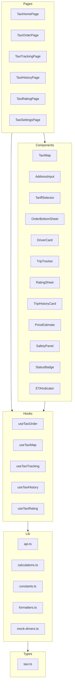
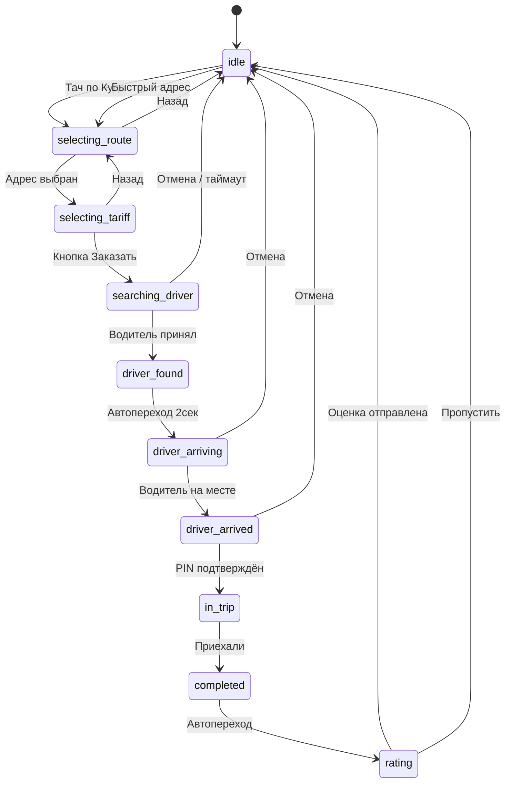

# План реализации модуля «Такси-агрегатор»

> **Дата:** 2026-03-06  
> **Статус:** Готов к реализации  
> **Стек:** React + TypeScript + Vite + Shadcn UI + Tailwind CSS + Leaflet  
> **Паттерн:** По аналогии с модулем Insurance

---

## 1. Анализ текущего состояния

### ✅ Уже реализовано (lib-слой)

| Файл | Описание | Статус |
|------|----------|--------|
| `src/types/taxi.ts` | 214 строк — все типы: OrderStatus, VehicleClass, PaymentMethod, TaxiAddress, Tariff, TariffEstimate, Driver, TaxiOrder, TripHistoryItem, FavoriteAddress, PromoCode, AddressSuggestion, TaxiOrderState, SurgeZone | ✅ Полный |
| `src/lib/taxi/constants.ts` | 265 строк — 7 тарифов, mock-адреса Москвы, surge-зоны, цвета тарифов, конфиги ожидания | ✅ Полный |
| `src/lib/taxi/calculations.ts` | 127 строк — Haversine-расстояние, ETA, расчёт стоимости, surge, чаевые, интерполяция позиции, генерация маршрутных точек | ✅ Полный |
| `src/lib/taxi/formatters.ts` | 142 строки — форматирование цены, расстояния, ETA, рейтинга, статуса, класса авто, способа оплаты, даты, маскировка номеров, генерация PIN | ✅ Полный |
| `src/lib/taxi/mock-drivers.ts` | 248 строк — 5 mock-водителей, генерация случайного водителя вблизи позиции, 5 поездок для истории | ✅ Полный |

### ❌ Отсутствует — нужно создать

| Слой | Файлы | Количество |
|------|-------|------------|  
| **API** | `src/lib/taxi/api.ts` | 1 файл |
| **Хуки** | `src/hooks/taxi/*.ts` | 6 файлов |
| **Компоненты** | `src/components/taxi/*.tsx` | 12 файлов |
| **Страницы** | `src/pages/taxi/*.tsx` | 6 файлов |
| **Интеграция** | `App.tsx`, `ServicesMenu.tsx` | 2 файла (обновление) |
| **Итого** | | **27 новых файлов + 2 обновления** |

---

## 2. Архитектура модуля



---

## 3. Маршрутизация

| Путь | Страница | Описание |
|------|----------|----------|
| `/taxi` | TaxiHomePage | Главная — карта + bottom sheet заказа |
| `/taxi/order/:id` | TaxiOrderPage | Ожидание водителя |
| `/taxi/tracking/:id` | TaxiTrackingPage | Поездка в процессе |
| `/taxi/history` | TaxiHistoryPage | История поездок |
| `/taxi/rating/:id` | TaxiRatingPage | Оценка после поездки |
| `/taxi/settings` | TaxiSettingsPage | Настройки — адреса, оплата |

---

## 4. Детальная спецификация каждого файла

### 4.1 `src/lib/taxi/api.ts` — Mock API

Централизованный слой данных, имитирующий реальные API-запросы с задержками:

- `searchAddresses(query)` — поиск адресов с фильтрацией по mock-данным, delay 300ms
- `getAddressSuggestions()` — получить избранные + недавние адреса
- `getTariffEstimates(from, to)` — расчёт стоимости всех тарифов
- `createOrder(pickup, destination, tariff, paymentMethod)` — создание заказа, возврат TaxiOrder
- `searchDriver(orderId)` — поиск водителя, delay 3-8 сек, возврат Driver
- `cancelOrder(orderId, reason)` — отмена заказа
- `getActiveOrder()` — получить активный заказ
- `getOrderById(orderId)` — получить заказ по ID
- `getOrderHistory()` — история поездок
- `rateTrip(orderId, rating, tip, comment)` — оценка поездки
- `applyPromoCode(code)` — проверка промокода
- `getDriverLocation(driverId)` — текущая позиция водителя (mock — каждый вызов немного сдвигает)
- `saveFavoriteAddress(address)` — сохранить избранный адрес
- `updatePaymentMethod(method)` — обновить способ оплаты
- `shareTrip(orderId)` — генерация ссылки для шаринга поездки
- `sendSos(orderId)` — вызов SOS

### 4.2 Хуки

#### `useTaxiOrder` — State Machine заказа

Главный хук, управляющий жизненным циклом заказа. Реализует FSM:

```
idle → selecting_route → selecting_tariff → searching_driver → driver_found → driver_arriving → driver_arrived → in_trip → completed → rating → idle
```

**Состояние:**
- `orderState: TaxiOrderState` — полное состояние заказа
- `isLoading`, `error` — стандартные состояния

**Действия:**
- `setPickup(address)` — установить точку подачи
- `setDestination(address)` — установить назначение
- `addStop(address)` — добавить промежуточную остановку
- `removeStop(index)` — удалить остановку
- `selectTariff(tariffId)` — выбрать тариф
- `setPaymentMethod(method)` — сменить способ оплаты
- `applyPromo(code)` — применить промокод
- `createOrder()` — создать заказ (запускает поиск водителя)
- `cancelOrder(reason)` — отменить заказ
- `confirmPickup(pin)` — подтвердить посадку PIN-кодом
- `completeTrip()` — завершить поездку
- `rateTrip(rating, tip, comment)` — оценить
- `resetOrder()` — сбросить в idle

#### `useTaxiMap` — Карта

- `mapCenter`, `mapZoom` — центр и зум карты
- `userLocation` — текущая геопозиция пользователя (navigator.geolocation)
- `routePoints` — массив точек маршрута для отрисовки polyline
- `driverMarker` — позиция маркера водителя
- `pickupMarker`, `destinationMarker` — маркеры A и B
- `centerOnUser()` — центрировать на пользователе
- `fitBounds(from, to)` — вписать маршрут в видимую область
- `nearbyDrivers` — маркеры водителей рядом (для idle состояния)

#### `useTaxiTracking` — Трекинг водителя

- Использует setInterval для имитации движения водителя
- `driverPosition` — текущая позиция водителя
- `etaMinutes` — оставшееся время
- `progress` — прогресс (0..1) движения
- `tripRoute` — маршрут поездки
- `startTracking(driver, route)` — начать трекинг
- `stopTracking()` — остановить
- Интерполяция через `interpolatePosition()` из calculations.ts

#### `useTaxiHistory` — История поездок

- `trips` — массив TripHistoryItem
- `isLoading` — загрузка
- `loadTrips()` — загрузить историю
- `filterByStatus(status)` — фильтр по статусу
- `filterByDate(from, to)` — фильтр по дате

#### `useTaxiRating` — Оценка

- `rating` — 1-5 звёзд (state)
- `tip` — чаевые (state)
- `comment` — комментарий (state)
- `tags` — выбранные теги
- `setRating(value)`, `setTip(value)`, `setComment(text)`, `toggleTag(tag)`
- `submitRating()` — отправить оценку
- `skipRating()` — пропустить

### 4.3 Компоненты

#### `TaxiMap.tsx` — Карта на Leaflet

- Полноэкранная карта с OpenStreetMap тайлами
- Маркеры: pickup (зелёный), destination (красный), водитель (синий с heading)
- Polyline маршрута
- Своя кнопка «Моё местоположение»
- Анимация маркера водителя при трекинге
- Nearby driver dots для idle-экрана
- Реагирует на props: `center`, `zoom`, `markers`, `route`, `onMapClick`

#### `AddressInput.tsx` — Ввод адреса

- Input с иконкой поиска
- Dropdown с результатами автокомплита
- Секции: Избранные (дом, работа), Недавние, Результаты поиска
- Debounce 300ms на ввод
- Поддержка «Указать на карте»
- Props: `label`, `value`, `onChange`, `onSelect`, `placeholder`

#### `TariffSelector.tsx` — Выбор тарифа

- Горизонтальный скроллируемый список тарифов
- Каждая карточка: emoji, название, цена, ETA, badge
- Surge-индикатор (×1.5) на карточке
- Активный тариф выделен цветом
- Skeleton-загрузка при расчёте цен
- Props: `estimates`, `selectedTariff`, `onSelect`, `isLoading`

#### `OrderBottomSheet.tsx` — Bottom Sheet заказа

Центральный UX-компонент, меняющий содержимое в зависимости от статуса OrderStatus:

| Статус | Содержимое |
|--------|-----------|
| idle | Поле «Куда?» + быстрые адреса |
| selecting_route | AddressInput pickup + destination |
| selecting_tariff | TariffSelector + PriceEstimate + кнопка «Заказать» |
| searching_driver | Анимация поиска + таймер + кнопка «Отмена» |
| driver_found / driver_arriving | DriverCard + ETAIndicator |
| driver_arrived | PIN-код + таймер ожидания + кнопки |
| in_trip | TripTracker + SafetyPanel |
| completed | Итоговая стоимость |
| rating | RatingSheet |

- Использует Shadcn `Sheet` или `Drawer` (bottom)
- Три уровня высоты: свернут (peek), средний, полный
- Drag-жест для изменения высоты

#### `DriverCard.tsx` — Карточка водителя

- Фото/аватар, имя, рейтинг (звёзды), количество поездок
- Информация об авто: марка, модель, цвет, номер (маскированный)
- ETA подачи
- Кнопки: Позвонить (иконка), Написать (иконка)
- Статус: «Едет к вам» / «На месте»

#### `TripTracker.tsx` — Трекинг поездки

- Прогресс-бар маршрута (от A до B)
- Текущая позиция на маршруте
- ETA до назначения
- Расстояние осталось
- StatusBadge текущего этапа

#### `RatingSheet.tsx` — Оценка

- 5 звёзд (анимированных)
- Быстрые теги: «Чистое авто», «Вежливый», «Быстро», «Хорошая музыка», «Тихая поездка»
- Чаевые: предустановки 0, 50, 100, 150, 200 ₽ + своя сумма
- Поле комментария
- Кнопки: «Отправить» / «Пропустить»

#### `TripHistoryCard.tsx` — Карточка в истории

- Маршрут: A → B (краткие адреса)
- Дата, время
- Тариф (badge), стоимость
- Водитель (имя, рейтинг)
- StatusBadge (completed/cancelled)
- Клик → детальная информация

#### `PriceEstimate.tsx` — Предварительная стоимость

- Итоговая сумма (крупно)
- Разбивка: базовая + за расстояние + за время + surge
- Surge-предупреждение при multiplier > 1.0
- Способ оплаты (с иконкой)
- Промокод (если применён — скидка)

#### `SafetyPanel.tsx` — Панель безопасности

- Кнопка SOS (красная, крупная)
- «Поделиться поездкой» — генерация ссылки
- Информация о маршруте
- Номер экстренных служб

#### `shared/StatusBadge.tsx` — Бейдж статуса

- Цветной бейдж с текстом статуса
- Цвета по статусу: idle → серый, searching → синий, in_trip → зелёный, cancelled → красный

#### `shared/ETAIndicator.tsx` — Индикатор ETA

- Время в минутах (крупно)
- Текст «мин» / «ч»
- Пульсирующая анимация при обновлении
- Иконка часов

### 4.4 Страницы

#### `TaxiHomePage.tsx` — Главная

- Полноэкранная карта TaxiMap
- OrderBottomSheet поверх
- Боковая кнопка «Мое местоположение»
- Header с кнопками: назад (к сервисам), история, настройки
- На idle: показ nearby водителей на карте

#### `TaxiOrderPage.tsx` — Процесс заказа

- Экран ожидания водителя
- Карта + анимация поиска (пульсирующий круг)
- Bottom sheet с DriverCard при нахождении водителя
- Автоматический переход в Tracking при статусе driver_arriving

#### `TaxiTrackingPage.tsx` — Отслеживание

- Карта с маршрутом и движущимся маркером водителя
- TripTracker + SafetyPanel
- ETA обновляется каждые 3 сек
- PIN-код при статусе driver_arrived

#### `TaxiHistoryPage.tsx` — История

- Список TripHistoryCard
- Фильтры: все, завершённые, отменённые
- Пустое состояние для новых пользователей
- Pull-to-refresh

#### `TaxiRatingPage.tsx` — Оценка

- RatingSheet в полноэкранном режиме
- После отправки → переход на /taxi

#### `TaxiSettingsPage.tsx` — Настройки

- Избранные адреса (дом, работа) с возможностью редактирования
- Способ оплаты (выбор из списка)
- Язык уведомлений
- Очистка истории

---

## 5. UX-поток заказа — State Machine



---

## 6. Зависимости — уже в проекте

| Пакет | Версия | Использование |
|-------|--------|---------------|
| `leaflet` | ^1.9.4 | Карта |
| `react-leaflet` | ^4.2.1 | React-обёртка для Leaflet |
| `@types/leaflet` | ^1.9.21 | Типы для TypeScript |
| Shadcn UI | — | Sheet, Drawer, Button, Card, Badge, Input, Dialog, Progress, Skeleton |
| `lucide-react` | — | Иконки: MapPin, Navigation, Phone, MessageCircle, Star, Clock, Shield, Share2, AlertTriangle |
| `framer-motion` или CSS | — | Анимации (пульсация поиска, движение маркера) |

---

## 7. Порядок реализации (от фундамента к UI)

### Фаза 1: Data Layer
1. `src/lib/taxi/api.ts` — Mock API

### Фаза 2: Business Logic
2. `src/hooks/taxi/useTaxiOrder.ts` — State Machine заказа
3. `src/hooks/taxi/useTaxiMap.ts` — работа с картой
4. `src/hooks/taxi/useTaxiTracking.ts` — трекинг
5. `src/hooks/taxi/useTaxiHistory.ts` — история
6. `src/hooks/taxi/useTaxiRating.ts` — оценка
7. `src/hooks/taxi/index.ts` — реэкспорт

### Фаза 3: Shared Components
8. `src/components/taxi/shared/StatusBadge.tsx`
9. `src/components/taxi/shared/ETAIndicator.tsx`

### Фаза 4: Feature Components
10. `src/components/taxi/TaxiMap.tsx` — карта
11. `src/components/taxi/AddressInput.tsx` — ввод адреса
12. `src/components/taxi/TariffSelector.tsx` — тарифы
13. `src/components/taxi/PriceEstimate.tsx` — стоимость
14. `src/components/taxi/DriverCard.tsx` — карточка водителя
15. `src/components/taxi/TripTracker.tsx` — трекинг
16. `src/components/taxi/RatingSheet.tsx` — оценка
17. `src/components/taxi/TripHistoryCard.tsx` — история
18. `src/components/taxi/SafetyPanel.tsx` — безопасность
19. `src/components/taxi/OrderBottomSheet.tsx` — bottom sheet (композиция)

### Фаза 5: Pages
20. `src/pages/taxi/TaxiHomePage.tsx`
21. `src/pages/taxi/TaxiOrderPage.tsx`
22. `src/pages/taxi/TaxiTrackingPage.tsx`
23. `src/pages/taxi/TaxiHistoryPage.tsx`
24. `src/pages/taxi/TaxiRatingPage.tsx`
25. `src/pages/taxi/TaxiSettingsPage.tsx`

### Фаза 6: Integration
26. Обновить `App.tsx` — роуты /taxi/*
27. Обновить `ServicesMenu.tsx` — route: "/taxi"

### Фаза 7: QA
28. Проверка всех переходов state machine
29. Проверка карты и маркеров
30. Проверка responsive дизайна

---

## 8. Ключевые алгоритмы по документации

### Расчёт стоимости (из раздела 5 документации)
```
price = base_fare + distance_km * per_km_rate + duration_min * per_min_rate
price *= surge_multiplier
price = max(price, min_price)
```
**Реализован** в `src/lib/taxi/calculations.ts` → `calculateTripPrice()`

### Surge Pricing (упрощённый для MVP)
Вместо ML-модели — mock-генератор с вероятностями:
- 60% → 1.0x, 20% → 1.2x, 12% → 1.5x, 8% → 2.0x
**Реализован** в `generateSurgeMultiplier()`

### Поиск водителя (mock)
- Задержка 3-8 сек (рандом)
- Генерация mock-водителя рядом с pickup
- 90% вероятность успеха, 10% — «нет водителей» → повторная попытка
**Будет в** `api.ts` → `searchDriver()`

### Движение водителя (интерполяция)
- Линейная интерполяция между точками маршрута
- Шаг каждые 3 сек (DRIVER_LOCATION_UPDATE_INTERVAL_MS)
- Noise для реалистичности
**Реализован** в `interpolatePosition()`, `generateRoutePoints()`

---

> **Статус:** План завершён, готов к передаче в Code mode для имплементации.
